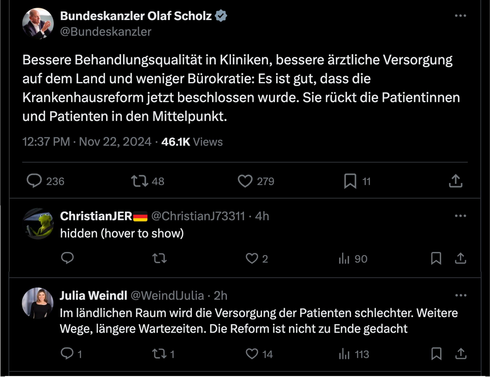

# twitter-filter

A Chrome extension that filters annoying Twitter content.

## Example

Once installed, the extension will hide posts based on your preferences.

You can see in the image below how hateful or inflammatory comments are hidden, whileo ther comments are shown as usual.
Filter criteria can be configured in extension options.

<p style="text-align: center;"></p>

## Usage

Install [Ollama](https://ollama.com).

Start Ollama.
```
// Start Ollama and allow connections from Chrome extensions.
OLLAMA_ORIGINS=chrome-extension://* ollama serve

// Optionally, set OLLAMA_ORIGIN system wide.
launchctl setenv OLLAMA_ORIGIN "chrome-extension://*"
```

[Load the Chrome extension](https://developer.chrome.com/docs/extensions/get-started/tutorial/hello-world#load-unpacked) in developer mode.

Configure the model and prompt in the extension options.
